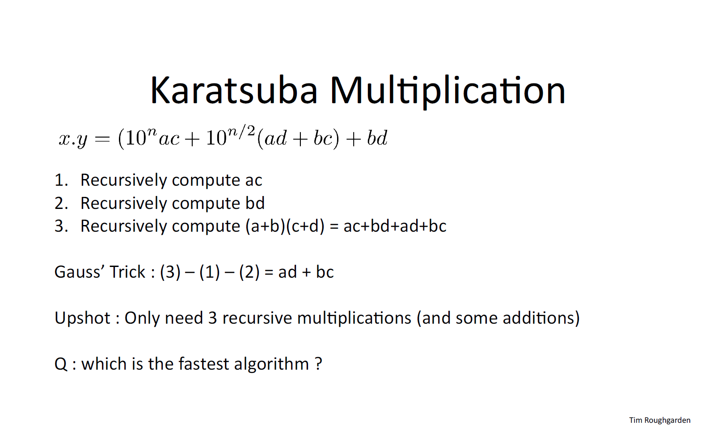

Question 1
In this programming assignment you will implement one or more of the integer multiplication algorithms described in lecture.

To get the most out of this assignment, your program should restrict itself to multiplying only pairs of single-digit numbers. You can implement the grade-school algorithm if you want, but to get the most out of the assignment you'll want to implement recursive integer multiplication and/or Karatsuba's algorithm.

So: what's the product of the following two 64-digit numbers?

3141592653589793238462643383279502884197169399375105820974944592

2718281828459045235360287471352662497757247093699959574966967627

[TIP: before submitting, first test the correctness of your program on some small test cases of your own devising. Then post your best test cases to the discussion forums to help your fellow students!]

[Food for thought: the number of digits in each input number is a power of 2. Does this make your life easier? Does it depend on which algorithm you're implementing?]

The numeric answer should be typed in the space below. So if your answer is 1198233847, then just type 1198233847 in the space provided without any space / commas / any other punctuation marks.

(We do not require you to submit your code, so feel free to use any programming language you want --- just type the final numeric answer in the following space.)

